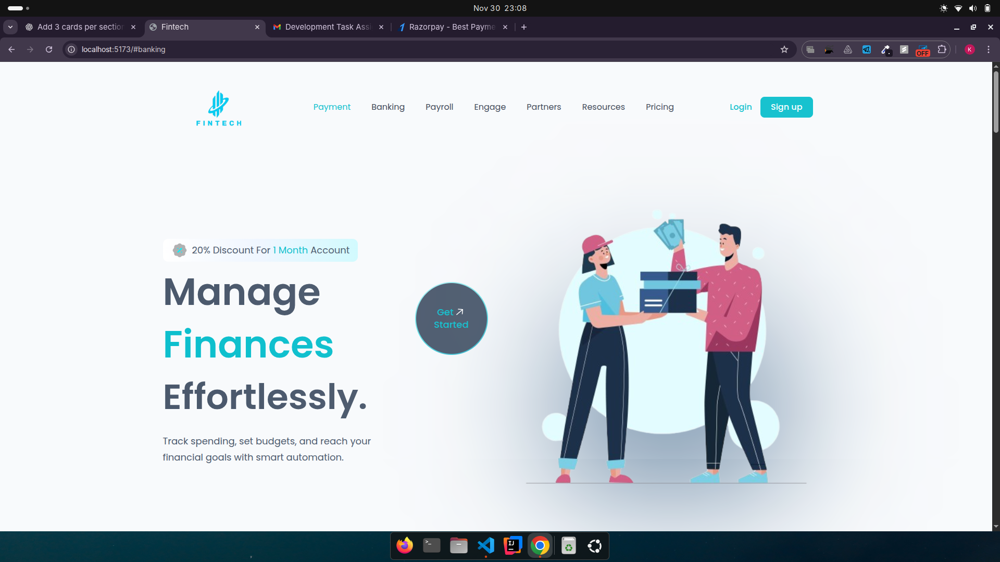
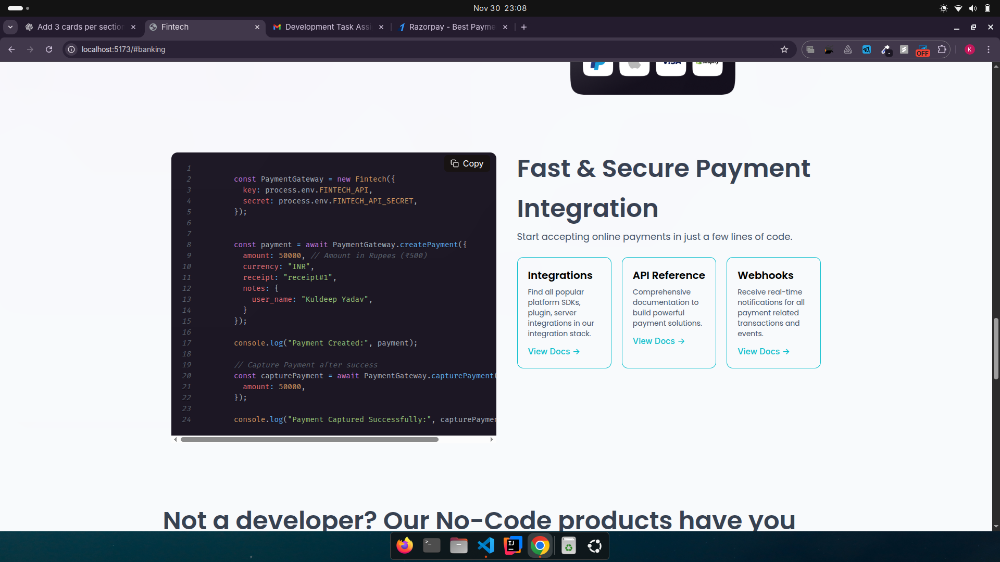
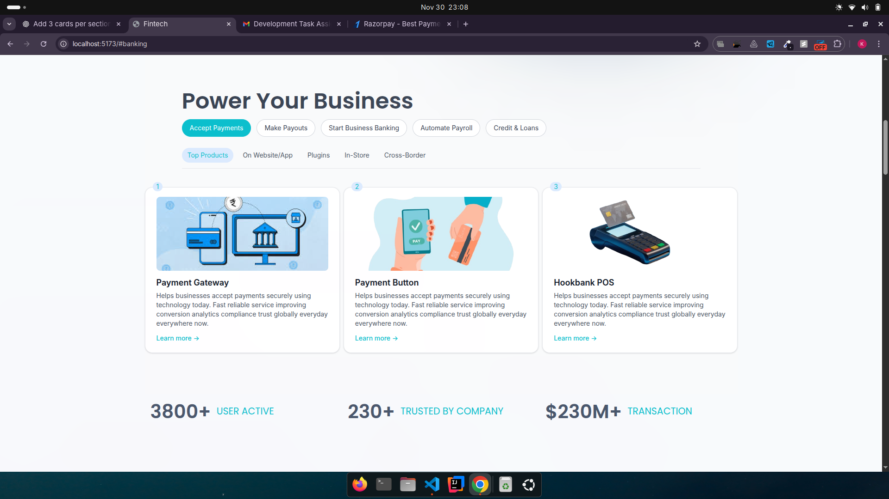

# Fintech Website

A modern and responsive Fintech web application built using **React**, **Tailwind CSS**, and **Framer Motion**.  
This project focuses on delivering a smooth, animated, and secure UI experience — inspired by the latest fintech product designs.

---
# Preview






## 🚀 Tech Stack

| Technology | Purpose |
|-----------|---------|
| **React** | UI Components & Rendering |
| **Tailwind CSS** | Utility-first Styling |
| **Vite** | Fast Bundler & Dev Server |
| **Framer Motion** | Smooth UI Animations |
| **React Icons** | Icons Library |
| **Lucide React** | Modern SVG Icons |
| **React Syntax Highlighter** | Code Block Component |
| **React Type Animation** | Text Typing Effects |

---

## 🛠️ Installation & Setup

Clone the repository:

```bash
git clone https://github.com/Kuldeep12e/Fintech.git
cd Fintech
``` 

Install dependencies:

```bash
npm install

```

Start development server:

```bash

npm run dev

```

#  Features

✔ Fully responsive UI (Mobile-First)
✔ Modern fintech design (similar to Razorpay/Stripe)
✔ Animated elements using Framer Motion
✔ Reusable Payment components
✔ Clean folder structure
✔ Highly scalable for future integrations


# Author

Kuldeep Yadav
📧 Email: kuldeep0105yadav@gmail.com
📍 India

## License

This project is licensed under the MIT License — free to use and modify.

